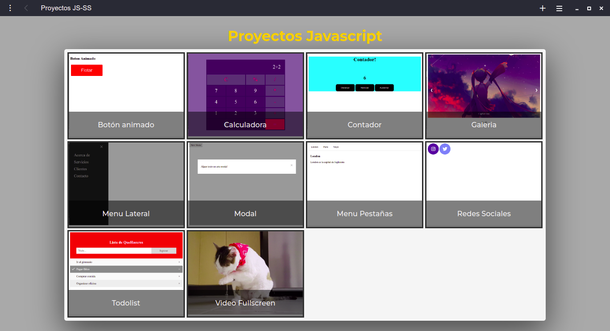

# Proyectos js 💼
* * *
Proyectos desarrollados usando HTML, CSS, y Javascript

## Comenzando 🚀
* * *
### Instalación 🔧
1. Ubicate en escritorio
2. Crea una carpeta portfolio
3. Abre la terminal
4. Escribe  gh repo clone jpinedadev/js-ss
5. Ve la carpeta js-ss
6. Abre index.html

## Construido con 🔨
* * *
- HTML
- CSS
- Javascript

### Screenshot

### Links

- Live Site URL: [Link](https://jpinedadev.github.io/js-ss/)

### Autor
* * *
Julio Pineda - Frontend Developer

### Licencia
***
* Mit
Por la presente se concede permiso, libre de cargos, a cualquier persona que obtenga una copia de este software y de los archivos de documentación asociados

